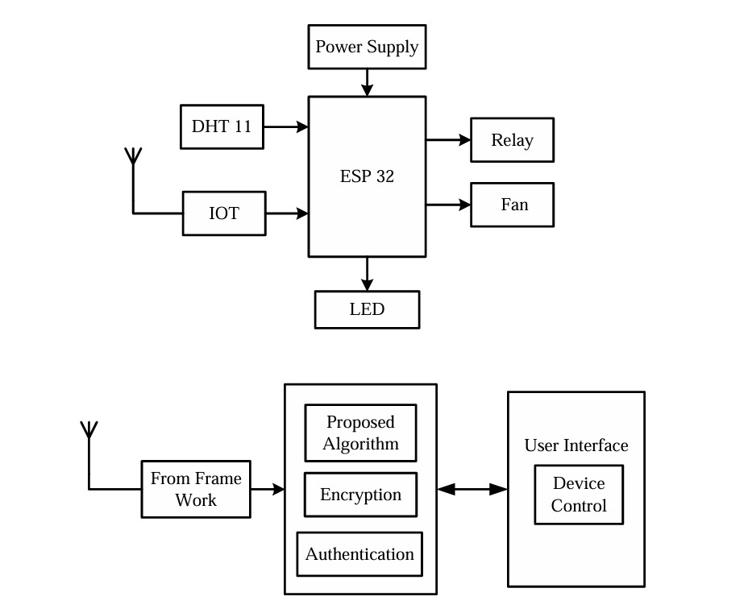

# Secure IoT-Based Smart Monitoring System

## 🔍 Abstract
The implementation of the proposed secure IoT-based smart monitoring system addresses the limitations of conventional IoT architectures by incorporating a robust, security-centric framework. At the core of this system are two independently operating microcontroller units, each interfaced with a distinct set of sensors tailored to specific monitoring requirements. These microcontrollers are responsible for the local collection, encryption, and preliminary processing of sensor data. Data is encrypted using AES before transmission, ensuring secure communication. Role-based access control and real-time intrusion detection enhance overall system security. The decentralized structure improves resilience and scalability, making the solution viable for critical sectors such as healthcare, industry, and infrastructure.

---

## 📌 Table of Contents
- [Introduction](#introduction)
- [Literature Review](#literature-review)
- [Existing System](#existing-system)
- [Proposed System](#proposed-system)
- [Block Diagram](#block-diagram)
- [Circuit Diagram](#circuit-diagram)
- [Working Principle](#working-principle)
- [Software Used](#software-used)
- [Advantages](#advantages)
- [Disadvantages](#disadvantages)
- [Future Enhancements](#future-enhancements)
- [Applications](#applications)
- [Conclusion](#conclusion)

---

## 📘 Introduction
Traditional IoT systems often face challenges related to data privacy, unauthorized access, and centralized vulnerability points. This project proposes a secure, decentralized IoT-based smart monitoring system using dual microcontrollers with AES encryption, real-time threat detection, and mutual device authentication.

---

## 📚 Literature Review
1. **Smith et al., 2019** – Presented a cloud-based IoT framework lacking localized encryption.
2. **Gupta & Sharma, 2020** – Proposed mutual authentication in sensor networks, but lacked real-time alerts.
3. **Lee et al., 2021** – Focused on smart healthcare monitoring but did not implement decentralized control.
4. **Kumar et al., 2022** – Introduced basic role-based access in IoT but lacked AES encryption and multi-controller support.
5. **Zhang & Chen, 2023** – Investigated anomaly detection via machine learning but without OTA security.

---

## 🏗 Existing System
- Centralized data collection and processing
- Vulnerable to single-point failures
- Lack of real-time threat detection
- Weak access control mechanisms

---

## 💡 Proposed System
- Dual microcontroller architecture
- AES-encrypted sensor data before transmission
- Role-based access control
- Real-time intrusion detection with instant alerts
- Decentralized and scalable design

---

## 🔲 Block Diagram
> The block diagram consists of sensors connected to microcontrollers, which encrypt and transmit data securely to the monitoring unit. Two microcontrollers work in parallel for redundancy and specialization.

---

## 🔧 Circuit Diagram
> A circuit involving sensors like temperature, gas, and motion modules connected to ESP32/Arduino boards, with encrypted transmission to cloud/Firebase through Wi-Fi modules.

---

## ⚙️ Working Principle
Sensors collect real-time data, which is encrypted locally via AES. Only authenticated users can access this data. Any suspicious access triggers alerts via Firebase, updating the dashboard hosted via WAMP Server. Mutual authentication ensures secure microcontroller communication.

---

## 💻 Software Used
- **WAMP Server** – Hosting the dashboard and backend in PHP
- **Firebase** – Real-time database and alert notification
- **PyCharm** – Python-based backend processing
- **HTML/CSS/JS/PHP** – Frontend dashboard for monitoring

---

## ✅ Advantages
- High data security with AES encryption
- Real-time intrusion detection
- Decentralized architecture increases reliability
- Role-based access ensures only authorized usage
- Flexible and scalable for multiple use cases

---

## ❌ Disadvantages
- Increased cost due to dual microcontroller usage
- Initial configuration and setup complexity
- Requires consistent internet connection for alerts

---

## 🚀 Future Enhancements
- Integrate machine learning for adaptive threat detection
- Add blockchain for immutable data logging
- Enable OTA (Over-the-Air) firmware updates
- Expand to 5G for higher data transfer speed
- Enhance GUI dashboards and cross-platform interoperability

---

## 🧩 Applications
- Smart Hospitals (e.g., ICU monitoring)
- Industrial Automation (e.g., gas leak detection)
- Manufacturing Plants
- Smart Cities (infrastructure surveillance)
- Server Rooms and Data Centers

---

## 🔚 Conclusion
This project successfully demonstrates a secure, scalable IoT-based smart monitoring system. With AES encryption, decentralized control, and real-time intrusion detection, it is suitable for sensitive environments. It goes beyond a prototype, offering a complete deployable solution for modern industrial and critical applications.

---

## 📷 Screenshots / Diagrams

---

## 🛠️ Project Setup
1. Clone this repository
2. Set up WAMP Server and run `index.php`
3. Connect microcontrollers with sensors
4. Use Firebase for real-time alerting
5. Open the dashboard to monitor live data

---

## 📄 License
This project is licensed under MIT. Feel free to modify and use with attribution.

